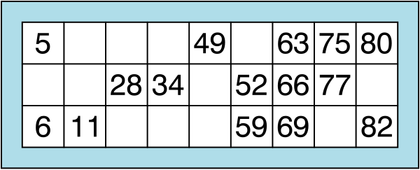

This is a simple CLI application to generate a Tambola card.
The default generated card follows Housie or UK Bingo rules:
- The cards contain 3 rows and 9 columns. 
- Each row contains five numbers and four blank spaces randomly distributed along the row. 
- Numbers are apportioned by column (1–10, 11–20, 21–30, 31–40, 41–50, 51–60, 61–70, 71–80 and 81–90)



The grid generation follows a two-pass algorithm:

- Pass 1: For each row, it randomly marks a fixed number of cells (based on numsPerRow) as blanks, ensuring that at least one number remains per column.

- Pass 2: It then fills the remaining (non-blank) cells column by column using unique random numbers from predefined ranges specific to each column, ensuring that values are sorted within the column.


References:
- https://en.wikipedia.org/wiki/Bingo_(British_version)
- https://en.wikipedia.org/wiki/Bingo_card

#### Prerequisites

- Java 21 or higher (for JAR version)
- GraalVM 21 or higher (for building native binary) - https://www.graalvm.org/downloads/

#### Building

```bash
cd TambolaGenerator
mvn clean package
```
Or if using Intellij IDEA,

go to **Build, Execution, Deployment > Build Tools > Maven > Runner**

and add **Environment variables**: `GRAALVM_HOME=/Library/Java/JavaVirtualMachines/graalvm-jdk-21.0.6+8.1/Contents/Home/`

Then run maven goal: `mvn clean package`

#### Install
```bash

sudo cp ./target/tambola-gen /usr/local/bin/
```

#### Usage

```bash
$ tambola-gen

$ tambola-gen --help
Usage: tambola-gen [-hV] [--csv] [--pretty] [-c=<cols>] [-n=<count>]
                   [--numsPerRow=<numsPerRow>] [-r=<rows>]
This is a simple CLI application to generate a Tambola card.
  -c, --cols=<cols>   Number of columns
                        Default: 9
      --csv           CSV print
  -h, --help          Show this help message and exit.
  -n=<count>          Number of cards to print
                        Default: 1
      --numsPerRow=<numsPerRow>
                      Numbers per row
                        Default: 5
      --pretty        Pretty print
  -r, --rows=<rows>   Number of rows
                        Default: 3
  -V, --version       Print version information and exit.

$ tambola-gen
[[ ,  ,  , 31, 43, 59, 66,  , 81],
[5, 15,  ,  , 49,  ,  , 71, 85],
[ , 18, 29, 33,  ,  , 70, 72,  ]]
  
$ tambola-gen -n 2 --pretty
.   17  .   36  .   56  63  .   83  
.   .   .   38  46  .   64  75  86  
7   .   23  39  .   .   .   77  88  

1   15  23  31  .   .   62  .   .   
6   17  .   38  44  .   .   .   82  
8   .   27  .   .   56  67  76  .   

$ tambola-gen --csv
5, , ,37, ,57,63,76, 
 ,17, ,40,43, , ,78,86
8,19,25, , , ,70,80,  

```
